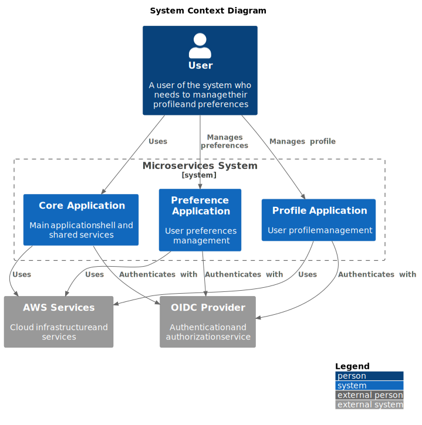
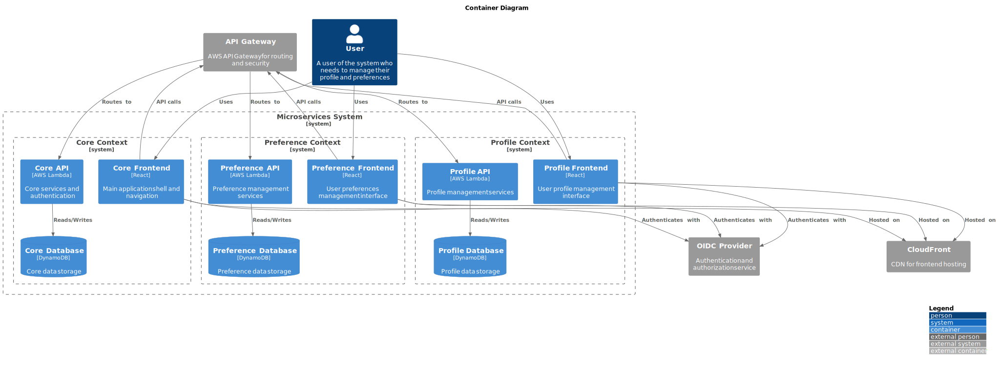

# Microservices Applications

🌐 **Demo Online**: [https://d13o1rfshhax5u.cloudfront.net/](https://d13o1rfshhax5u.cloudfront.net/)

## 🚀 Sobre o Projeto

Este é um projeto de microserviços que implementa uma aplicação de gerenciamento de contas com diferentes contextos. A aplicação é composta por três contextos principais: Core, Preference e Profile, cada um com seu próprio backend e frontend.

## 🛠️ Tecnologias Utilizadas

### Backend
- Java 21
- Quarkus (Compilação Nativa)
- AWS Lambda
- AWS API Gateway
- AWS DynamoDB
- AWS SAM (Serverless Application Model)
- Docker

### Frontend
- React
- Material-UI
- Auth0
- Webpack
- Jest
- React Testing Library

## 📋 Estrutura do Projeto


```
.
├── contexts/                 # Contextos de negócio
│   ├── core/                # Contexto Core
│   ├── preference/          # Contexto de Preferências
│   └── profile/             # Contexto de Perfil
└── docs/                    # Documentação
```

## 📚 Documentação

## 📊 Diagramas de Arquitetura

### Contexto do Sistema


### Container



## 🏗️ Arquitetura

O projeto é dividido em três contextos principais:

- **Core**: Gerenciamento de contas e autenticação
- **Preferências**: Configurações e preferências do usuário
- **Perfil**: Gerenciamento de perfis e dados pessoais

## 🚀 Começando

Para iniciar o desenvolvimento:

```bash
# Instalar dependências
npm install

# Iniciar em modo desenvolvimento
npm run dev

# Build para produção
npm run build
```

## 📝 Licença

Este projeto está sob a licença MIT. Veja o arquivo [LICENSE](LICENSE) para mais detalhes.
